# Pacman x PIET Neon-style Game Display

This p5.js project displays neon-style text inspired by arcade aesthetics.

## 1. INTERACTION, ANIMATION APPROACH, AND DRIVER
- _**How to Interact with the Work**_
    - This project features _**two interaction methods:**_
        1. **Mouse Click:** 
        triggers background music
        ```
        "Click the screen to start the music"
        ```
        2. **Sound Input:** 
        animates text in response to audio amplitude
    - Clicking anywhere on the canvas starts the background track. Once the music is playing, the title texts _"Pacman" and "* PIET"_ begin to **flicker and glow**. Their brightness is driven by the **live sound input**, creating a reactive neon light effect that synchronizes with the music.

- _**My Individual Animation Approach**_
    - My contribution focuses on the text animation, designed to resemble a retro arcade neon sign. I use a **dot-matrix typography style** rendered with circles instead of `text()` to gain fine-grained control over visual rhythm. The layout is inspired by **arcade aesthetics** and **Piet Mondrian’s grid compositions.**
    - This animation is visually distinct from the rest of the project by:
        1. Animating text
        2. Using brightness and flicker changes rather than motion or color
        3. Responding to audio input instead of mouse movement or time

- _**What Drives My Animation**_
1. **Driver:** Audio input (via `p5.FFT`)
2. **Effect:** Maps amplitude values to brightness of each text dot
3. **Result:** Text pulses in sync with music beats, simulating real-time audio-reactive neon signage

## 2. VISUAL INSPIRATIONS
The visual language of my individual contribution draws heavily from **retro arcade aesthetics,** with a particular focus on **dot-matrix text,** **vintage gaming consoles,** and **neon signage.** These elements work together to evoke the feeling of an old-school game cabinet brought to life with modern browser technology.
1. Dot-Matrix Text
Inspired by pixel-based displays used in vintage game systems, my text design uses a grid of circular dots to form letters. 
    - [Example of Dot-Matrix LED Text](https://www.instructables.com/Arduino-LED-Display/)
    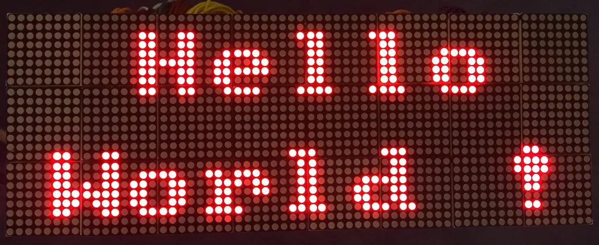
2. Neon Signboard Effect
The animation effect is influenced by neon shop signs, particularly the kind seen in 1980s diners or city arcades.
    - [Example of Neon Signboard Effect](https://au.pinterest.com/pin/38843615660942623/)
    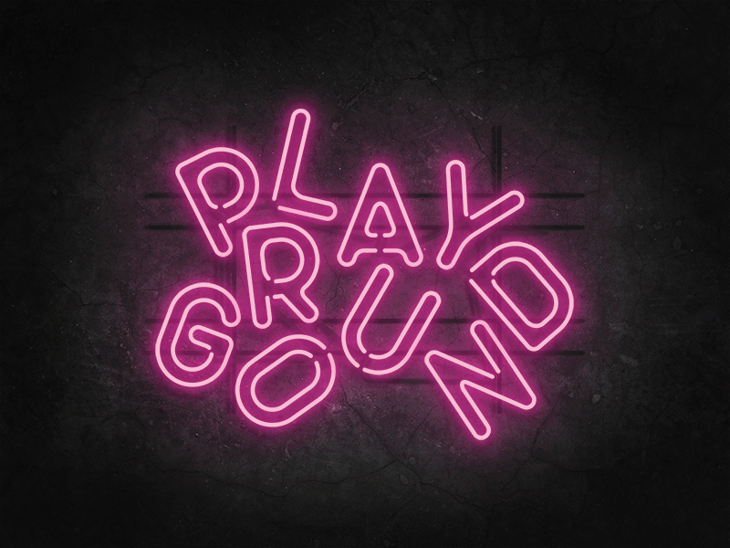
3. Arcade Console Interface
The overall layout, including the static visual elements such as the joystick, buttons, and console frame, is inspired by physical arcade cabinets. These elements serve a purely decorative function but play a key role in immersing the viewer in the arcade atmosphere.
    - [Example of Arcade Console](https://au.pinterest.com/pin/1089660072354104992/)
    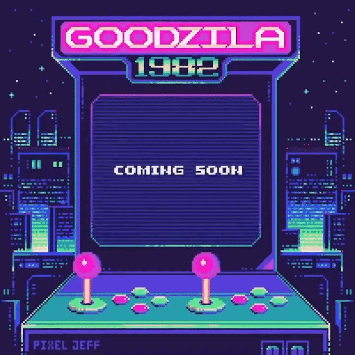

## 3. CHANGES MADE TO GROUP CODE
I made several substantial changes to the group’s original code to integrate my interaction-driven neon text animation:
1. **Restored Missing Interaction Logic**
- In the group version, the key interactivity—click-to-start audio and audio-reactive text—had been removed or overwritten. I reimplemented:
    - A `mousePressed()` function to trigger background music and resume the audio context.
    - A conditional logic block inside `draw()` that displays an instruction banner ("Click the screen to start the music") at the bottom of the screen before music begins.
    - An `if (!song.isPlaying())` condition to control this display, ensuring it disappears once the audio starts.
2. **Reintegrated Audio-Reactive Text**
- I reintroduced `p5.Amplitude()` and used `analyser.getLevel()` to drive the brightness of text points.
- The titles "Pacman" and "* PIET" were converted into vector dot-point arrays via `font.textToPoints()`, and each point is rendered with `ellipse()` and a glowing shadow blur effect.
- The brightness of these dots dynamically responds to live audio input, creating the illusion of flickering neon.
3. **Improved Visual Feedback**
- Added a soft translucent rectangle behind the instruction text to ensure legibility over the complex background.
- Tuned brightness mapping and `constrain()` values for a more responsive and realistic light flicker synced with audio beats.
4. **Structural Fixes and Optimizations**
- Moved `setPaths()` out of the `draw()` loop and placed it in `setup()` to avoid performance issues caused by continuously pushing new paths into the array each frame.
- Corrected asset paths (e.g., sound file and font file) to ensure they load properly in a browser environment.
- Organized `draw()` for better logical flow between static visuals, animation layers, and conditional UI prompts.

## 4. USE OF TOOLS & TECHNIQUES FROM OUTSIDE THE COURSE
1. _**`textToPoints()` from p5.Font**_
    - **Why I used it**
        - I wanted to create a **neon sign effect** that mimics the look of **pixel-based arcade text**. To achieve this, I needed to convert the text characters into a set of vector points so I could manually render each character as a collection of glowing circles. This was not achievable using the basic `text()` function.
    - **How it works**
        - `textToPoints()` is a function in p5.js that takes a string and converts it into an array of point objects based on the shape of the letters in a loaded font. Each point contains `x` and `y` coordinates, and an optional `sampleFactor` can be used to control the density of the points.
    - **Code Used**
    ```
    pointsPiet = pixelFont.textToPoints("* PIET", 270 + offsetX, 180, 100, { sampleFactor: 0.12 });
    pointsPiet = pixelFont.textToPoints("* PIET", 270 + offsetX, 180, 100, { sampleFactor: 0.12 });
    ```
    - **Source**
    [p5.js Reference - textToPoints()](https://p5js.org/reference/#/p5.Font/textToPoints)
        - P5.js example of `textToPoints()` usage:
    ```
    // Get the point array.
    let points = font.textToPoints('p5*js', 6, 60, 35, { sampleFactor:  0.5 });

    // Draw a dot at each point.
    for (let p of points) {
        point(p.x, p.y);
    }
    ```
2. _**`drawNeonText()` – Custom Neon Glow Effect**_
    - **Why I used it**
        - To create a **neon glow effect** around the text, I needed a custom function that could render each point with a glowing shadow. This effect is not provided by default in p5.js and required manual control over the rendering process.
    - **How it works**
        - The `drawNeonText()` function iterates through an array of points generated by `textToPoints()`, drawing each point as a circle with a glow effect. The brightness of each circle is dynamically adjusted based on the audio input level, creating a flickering neon light effect.
    - **Code Used**
    ```
    function drawNeonText(points, brightness, offsetX = 0, offsetY = 0) {
        for (let pt of points) {
            fill(255, 255, 0, brightness);
            drawingContext.shadowBlur = 10;
            drawingContext.shadowColor = color(255, 255, 0, brightness);
            ellipse(pt.x + offsetX, pt.y + offsetY, 5);
            drawingContext.shadowBlur = 0;
            drawingContext.shadowColor = color(0, 0, 0, 0);
            noFill();
        }
    }
    ```
    - **Source**
        - From ChatGPT
    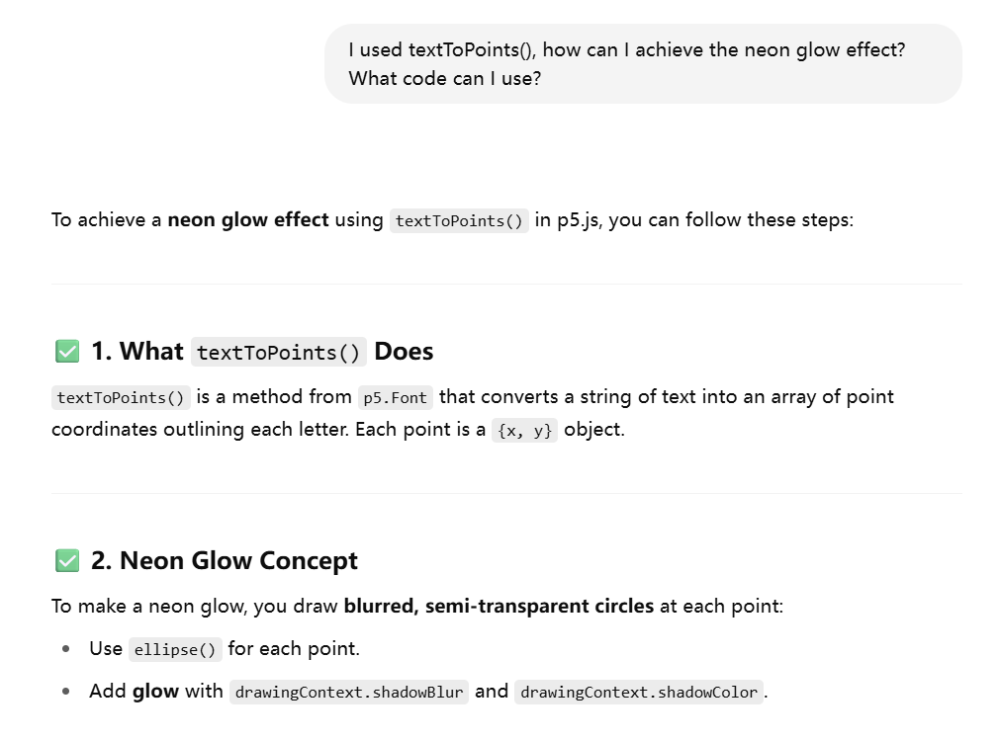
    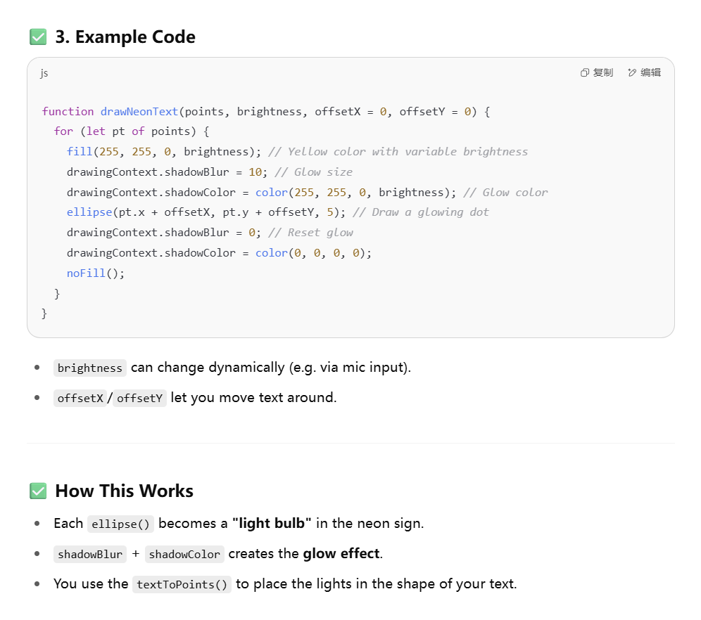
    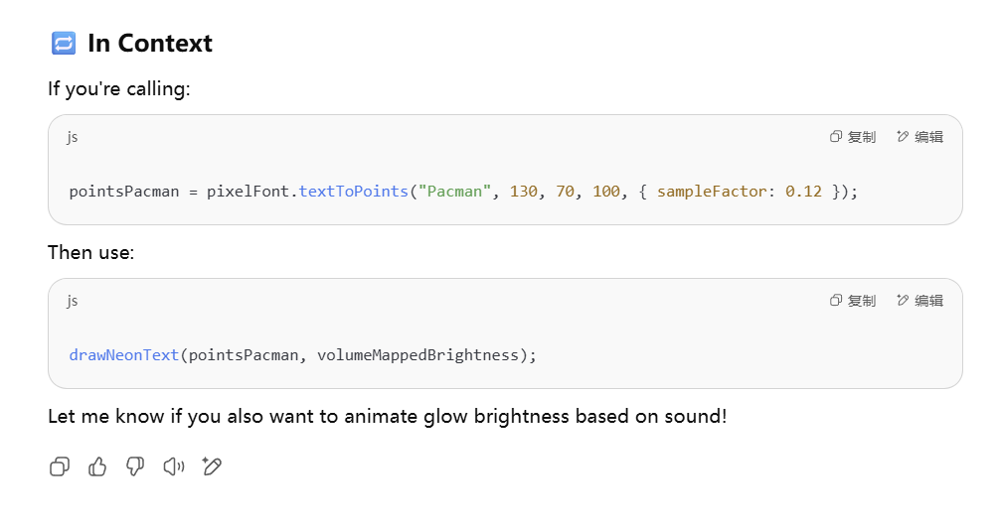

## 5. MAKING & ITERATION PROCESS (INDIVIDUAL WORK)
1.  _**Text Rendering:** From Static Text to Point-Based Custom Control_
    - Before – Using text() to Render Static Text
        - **Code Used**
        ```
        textFont(pixelFont);
        textSize(100);
        text("Pacman", 100, 100);
        ```
    - After – Using textToPoints() for Custom Control
        - **Code Used**
        ```
        pointsPacman = pixelFont.textToPoints("Pacman", 130 + offsetX, 70, 100, {
            sampleFactor: 0.12,
        });
        ```
2. _**Neon Effect: From Simple Fill to Realistic Glow**_
    - Before – Simple Filled Circles Without Glow
        - **Code Used**
        ```
        fill(255, 255, 0);
        ellipse(pt.x, pt.y, 5);
        ```
    - After – Adding Glow with `drawingContext.shadowBlur`
        - **Code Used**
        ```
        function drawNeonText(points, brightness) {
            for (let pt of points) {
                fill(255, 255, 0, brightness);
                drawingContext.shadowBlur = 10;
                drawingContext.shadowColor = color(255, 255, 0, brightness);
                ellipse(pt.x, pt.y, 5);
                drawingContext.shadowBlur = 0;
                drawingContext.shadowColor = color(0, 0, 0, 0);
            }
        }
        ```
3. _**Interactivity: From Static Brightness to Audio-Responsive Light**_
    - Before – Static Brightness (No Interaction)
        - **Code Used**
        ```
        drawNeonText(pointsPacman, 150);
        ```
    - After – Brightness Controlled by Microphone Input
        - **Code Used**
        ```
        let vol = mic.getLevel();
        let brightness = map(vol, 0, 0.3, 30, 255);
        drawNeonText(pointsPacman, brightness);
        drawNeonText(pointsPiet, brightness);
        ```
3. _**Images Of The Iteration Process**_

    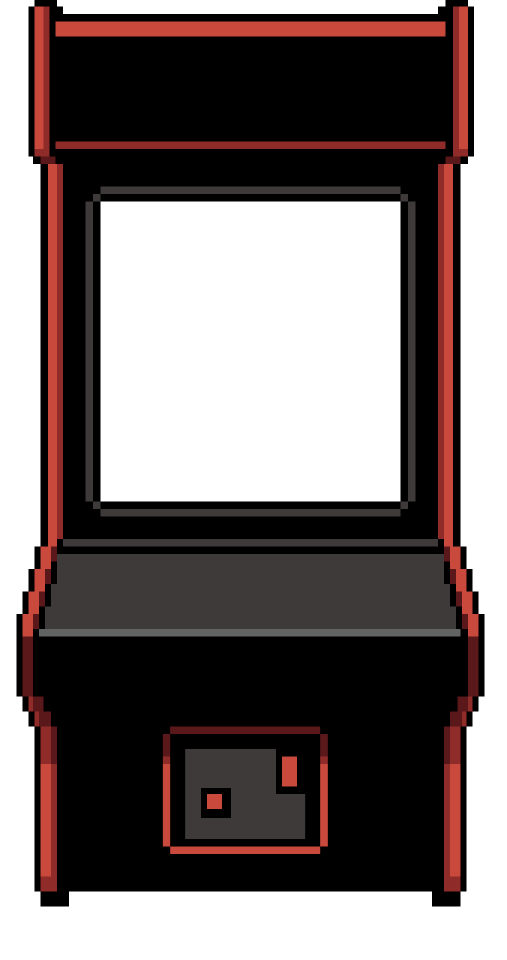

    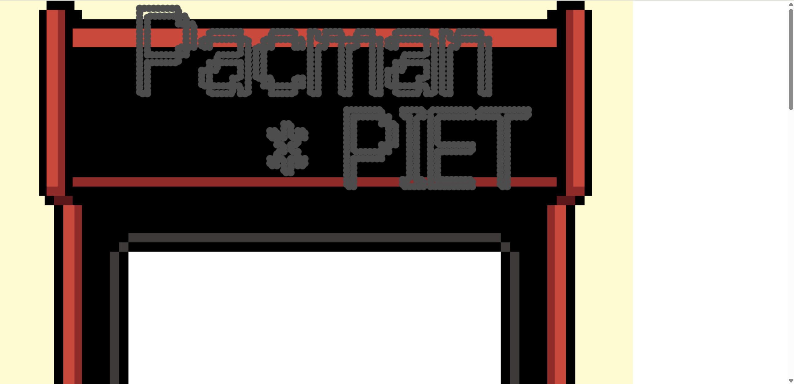

    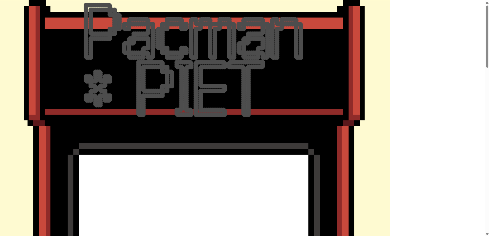

    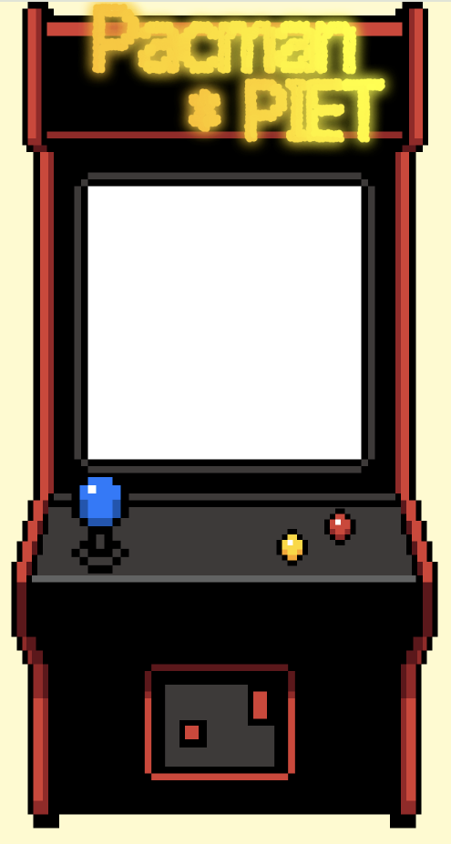

    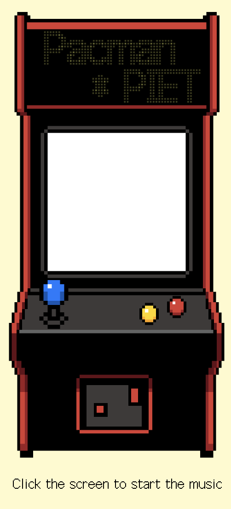

    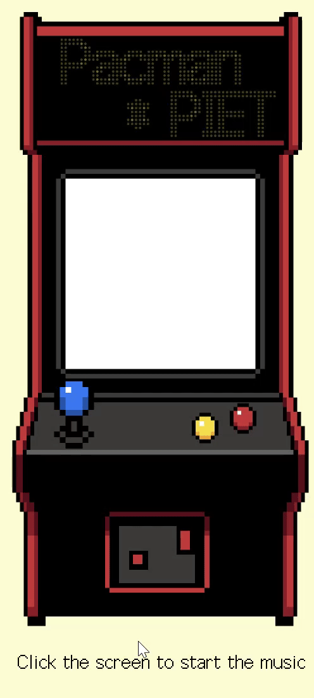

